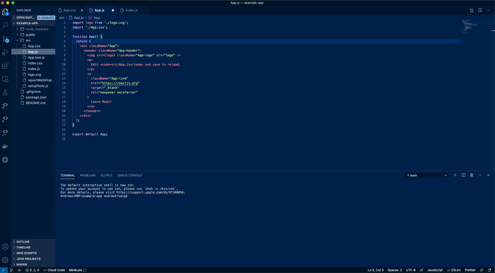
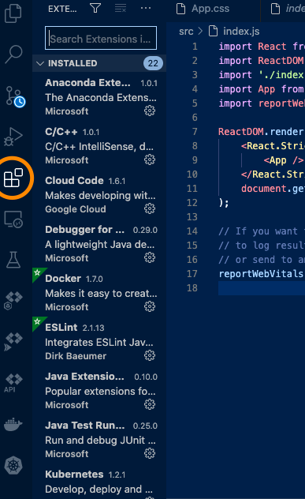
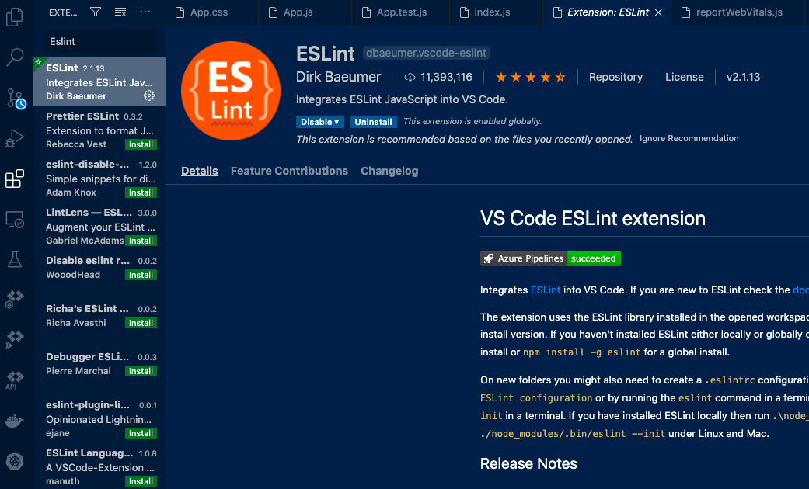
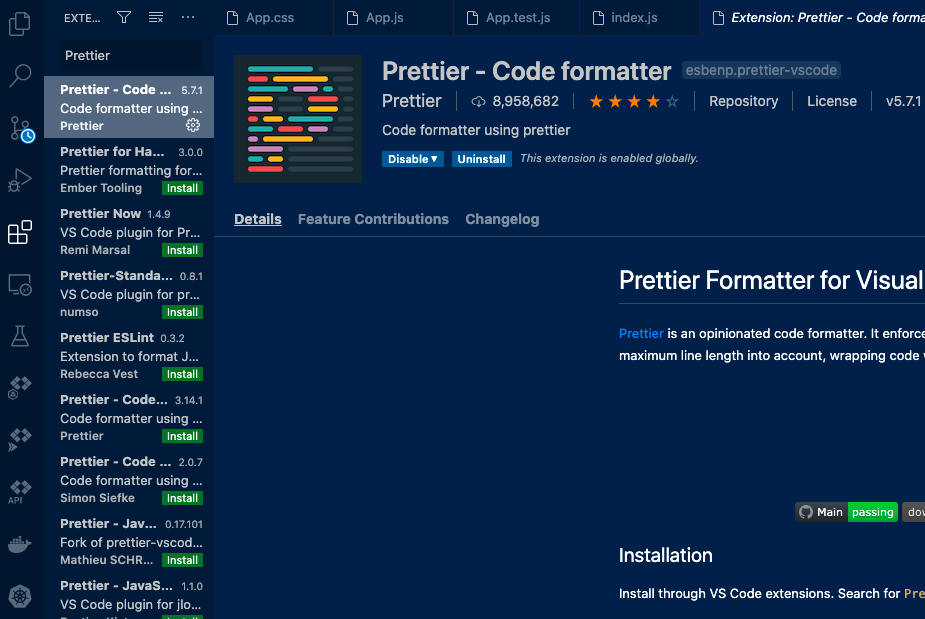
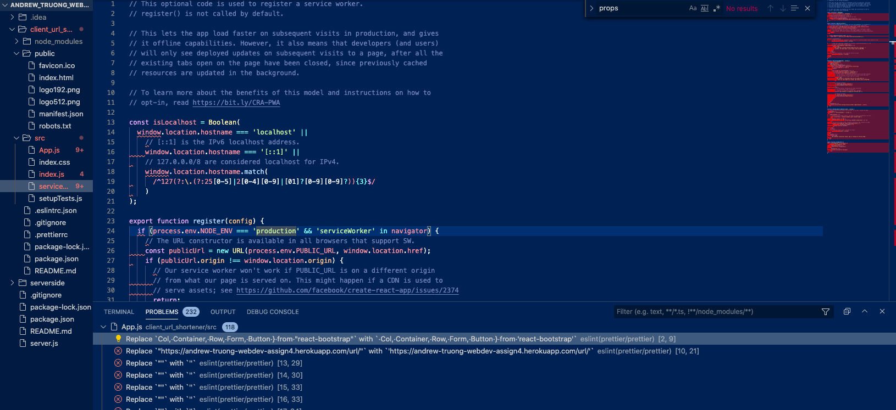
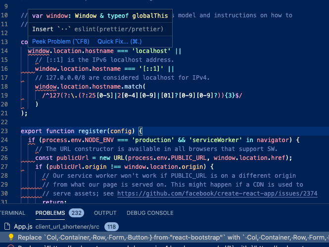
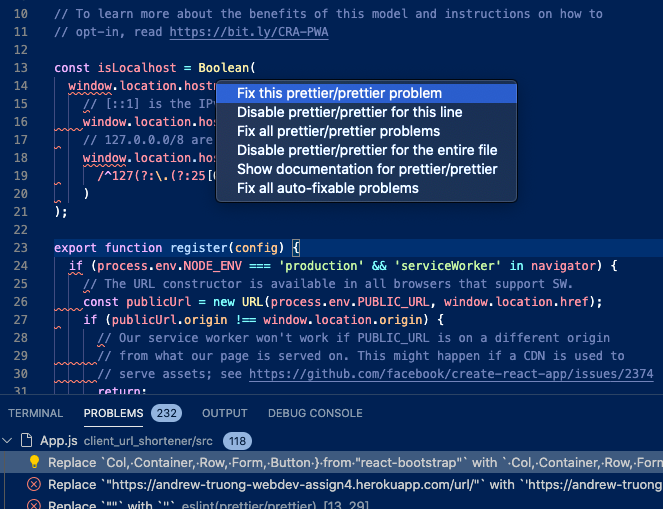
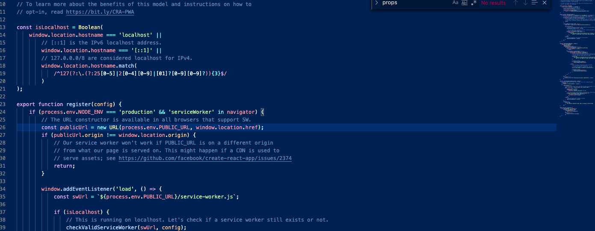
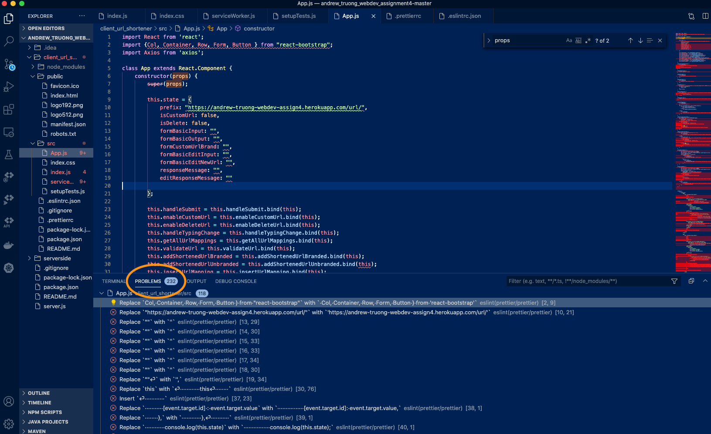

# CS5610 Web Development
# Adding ESLint and Prettier to your React/NPM Project

## Quick References
### Table of Contents
- [Introduction](#Introduction)
- [Getting Started](#Getting-Started)
- [ESLint Configuation](#ESLint-Configuation)
- [Prettier Configuration](#Prettier-Configuration)
- [Further Configuration](#Further-Configuring-ESLint-to-include-Prettier-and-a-few-other-rules)
- [Final Notes](#Final-Notes)

### .eslintrc.json (current config)
```javascript
{
    "env": {
        "browser": true,
        "es2021": true,
        "node": true
    },
    "extends": [
        "eslint:recommended",
        "plugin:react/recommended",
        "prettier"
    ],
    "parserOptions": {
        "ecmaFeatures": {
            "jsx": true
        },
        "ecmaVersion": 12,
        "sourceType": "module"
    },
    "plugins": [
        "react",
        "prettier"
    ],
    "rules": {
        "prettier/prettier": "error",
        "no-unused-vars":"warn"
    }
}

```

### .prettierrc (current config)
```javascript
{
    "printWidth":80,
    "tabWidth":4,
    "useTabs":false,
    "semi":true,
    "singleQuote":true,
    "trailingComma":"es5",
    "bracketSpacing":true,
    "jsxBracketSameLine":true,
    "arrowParens":"avoid"
}
```

### Exceptions to the rules
- None currently

## Updates
- 10/27/20
    - Tutorial created

## Introduction

**ESLint** is a popular NPM package that is used to check your Javascript code for possible syntax errors, and allows you to quickly reference rules through provided links that can help guide you to correct these errors. It also comes with a recommended extension for React code, which we will also make use of.

**Prettier** is an auto-formatting tool that gives you the option to automatically format code based on a set of style rules you supply it. In this tutorial, we will provide you a set of style rules that we will use for this class and will also show you how to configure ESLint to work in conjunction with Prettier to help point out to you places in your code where you might be violating any of these rules and give you the option of automatically correcting them.

The goal of these two packages is to standardize the "Clean Code" portion of your assignment grades, help teach you to follow specific Javascript style guide lines, and help you practice writing clean code. Of course, the style rules that are provided are unique to this class. There are many other style guides (like google, airbnb, and mozilla) that are much more detailed, but we have decided to only provide very basic rules for the sake of simplicity. This is by no means perfect, but it is a nice and easy way to start to standardizing code style for this class.

Starting with Assignment 2, this will be made as a requirement for your React Projects. We will be using these packages to check your style, and will mark you down for any **ERRORS** (red-underlined indications) that appear in your code. **WARNINGs** (yellow-underlined indications) will not be counted against you, but it is **HIGHLY** recommended that you correct these warnings.

## Getting Started

For this tutorial, we will need [**VSCode**](https://code.visualstudio.com/)  editor. Make sure that you have this editor downloaded and installed on your local machine.

Once you have that installed on your machine, go ahead and open your `React` project in the VSCode editor:



You'll want to start by installing the **ESLint** and **Prettier** plugins to your **VSCode** editor.

Click on the "Extensions" icon located on the left vertical icon menu. Search and install "ESLint" and "Prettier". Photos of these extensions are posted below:







Next, you will want to install the **ESLint** and **Prettier** packages to your npm project:

Open up a new integrated Terminal (From the menu bar, go to *Terminal* > *New Terimal*).

Make sure that your npm installation is up to date (Node.js (^10.12.0, or >=12.0.0)). Also, make sure that you are at the root of your project. In the command line at the root of your project directory, type in the command:

```javascript 
npm i -D eslint prettier eslint-plugin-prettier eslint-config-prettier eslint-plugin-node eslint-config-node
```

Let these packages install. Once they are done, you will want run the following command to install **ESLint** globally. You will only have to do this once:

```javascript
sudo npm i -g eslint
```

## ESLint Configuation

Now that ESLint is installed globally, we can initialize a configuration file for eslint that will be named `.eslintrc.json`. ESLint has a that walks you through making initial configurations to your `.eslintrc.json`, which can be executed by entering in the following command into your command line (make sure that you are still at the root of your project directory):

```javascript
eslint --init
```

ESLint init will take you through a set of questions. Select the following answers for each question:

```
How would you like to use ESLint?
- To check syntax and find problems

What type of modules does your project use?
- JavaScript modules (import/export)

Which framework does your project use?
- React

Does your project use TypeScript?
- No

Where does your code run?
- Browser AND Node (select both by keypressing 'a', then hit enter)

What format do you want your donfig file to be in?
- JSON

Would you like to install them now with npm?
- Yes
```

Once this is done, you should have an `.eslintrc.json` file located in your root directory. Make sure to check if it is there.

And that's it! We will come back to this file later once we configure Prettier.

## Prettier Configuration

Prettier's configuration is quite straightforward. You will need to first create an `.prettierrc` configuration file in your project's root directory, which is the same place where your `.eslintrc.json` configuration file should be. You can just do this by using VSCode's GUI to add a new file or just run the following command:

```
touch .prettierrc
```

We will next add the following text to the `.prettierrc`. Make sure to hit save once you make these changes:

```javascript
{
    "printWidth":80,
    "tabWidth":4,
    "useTabs":false,
    "semi":true,
    "singleQuote":true,
    "trailingComma":"es5",
    "bracketSpacing":true,
    "jsxBracketSameLine":true,
    "arrowParens":"avoid"
}
```
These configurations are unique to this class, and are subjected to change in the future as needed. I have listed the options that we have now here with a quick description for each of them. You can also search on [Prettier's Options List](https://prettier.io/docs/en/options.html) for more info:

 - "printWidth":80
    - The line length threshhold that the printer will wrap on.
 - "tabWidth":4
    - Number of spaces per indentation
 - "useTabs":false
    - We will have you use spaces instead of tab characters for indentation.
 - "semi":true
    - Every statement ends in a semicolon
 - "singleQuote":true
    - For strings, we will standardize single quotes.
 - "trailingComma":"es5"
    - Trailing comma rules will follow ES5 standards (search this up on google for more details).
 - "bracketSpacing":true
    - Prints spaces between brackets of object literals.
 - "jsxBracketSameLine":true
    - Put the `>` of a multi-line JSX element at the end of the last line instead of being alone on the next line (does not apply to self closing elements)
 - "arrowParens":"avoid"
    - If there is only a single parameter in an arrow function, don't surround it with parantheses
    
In this repo, you will find the `.prettierrc` file that we are currently using. You are allowed to copy and use that if you wish.

## Further Configuring ESLint to include Prettier and a few other rules:

Once both your `.eslintrc.json` and `.prettierrc` configuration files have both been created, it's time to modify your `.eslintrc.json` file to add Prettier's functionality.

Go ahead and open your `.eslintrc.json` file, it should look like this:

```javascript
{
    "env": {
        "browser": true,
        "es2021": true,
        "node": true
    },
    "extends": [
        "eslint:recommended",
        "plugin:react/recommended"
    ],
    "parserOptions": {
        "ecmaFeatures": {
            "jsx": true
        },
        "ecmaVersion": 12,
        "sourceType": "module"
    },
    "plugins": [
        "react"
    ],
    "rules": {
    }
}
```

We are going to make changes to the `"extends"`, `"plugins"`, and `"rules"` attributes as follows:

```javascript
"extends": [
    "eslint:recommended",
    "plugin:react/recommended",
    "prettier"
],
```

```javascript
"plugins": [
    "react",
    "prettier"
],
```

```javascript
"rules": {
    "prettier/prettier": "error",
    "no-unused-vars": "warning"     
}
```

Your final `.eslintrc.json` configuration should look like this:

```javascript
{
    "env": {
        "browser": true,
        "es2021": true,
        "node": true
    },
    "extends": [
        "eslint:recommended",
        "plugin:react/recommended",
        "prettier"
    ],
    "parserOptions": {
        "ecmaFeatures": {
            "jsx": true
        },
        "ecmaVersion": 12,
        "sourceType": "module"
    },
    "plugins": [
        "react",
        "prettier"
    ],
    "rules": {
        "prettier/prettier": "error",
        "no-unused-vars":"warn"
    }
}
```

## How to use once installed
Once everything above has been properly installed, you should start seeing ESLint "Problems" pop up as you click through your files. Sometimes, problems don't start popping up until you inspect a file, so be sure to click through each of your `.js` files so that the problems pop up if you have any.

It will look like this:



To inspect a problem and find a way to fix it **hover over the underlined problem** until a context window pops up. There will be a "Quick Fix" option within that context window. Click on that and it will give you options to help you fix your issue: 





As you can see, there are several options to help you deal with any ERROR warnings. These are usually "Fix this <problem type> problem", "Disable <problem type> for this line/entire file" or "Show documentation for <problem type>". The beauty with **Prettier** is that if you click "Fix this...", then it will automatically reformat the problem code for you according to the prettier rules that we have set up for the project.

"Show documentation" will open a webpage for you that shows the documentation for rules that pertain to that particular problem.

There is also the "Fix all auto-fixable problems", which will have **Prettier** reformat everything it can throughout the entire file, but we encourage you to work through each problem to practice our cleaner code practices.

Below is an image of what this particular example looks like after I have gone through all the problems and reformatted the code to our **Prettier** + **ESLint** standards:



You can also view all of your problems in the "Problems" Tab of the Terminal pane:




## Final Notes
Please do note that we are trying this coding standard out for the first time for this class, so the configurations for the `.prettierrc` and `.eslintrc.json` files are subjected to change over time.

This is why we will have the configurations for both files displayed at the top of this document under [Quick References](#Quick-References) section. Any updates will also be listed under the [Updates](#Updates) section, so keep an eye out for that.

And as always, if you have any questions or problems, please don't be afraid to reach out and let us know through our [Canvas Discussion Board](https://northeastern.instructure.com/courses/22216/discussion_topics)!
